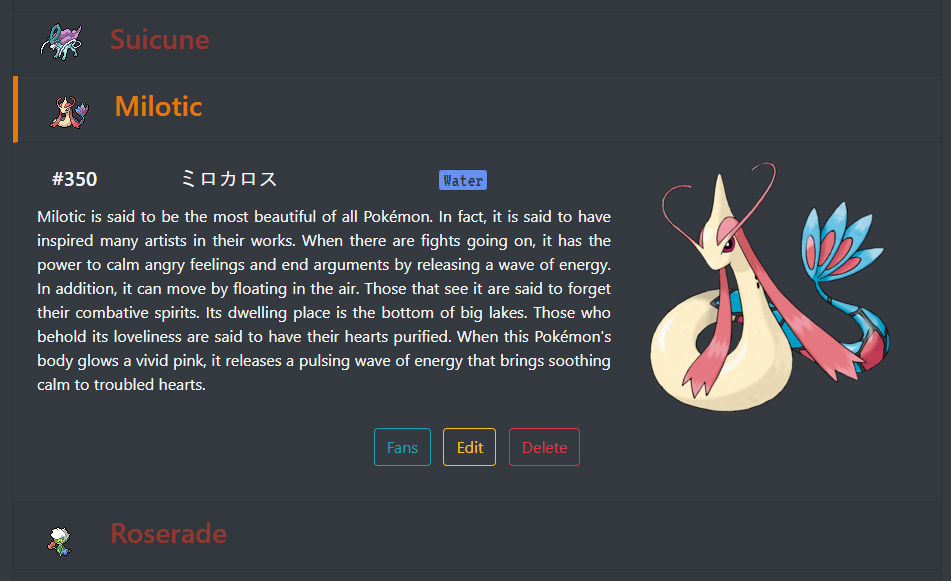
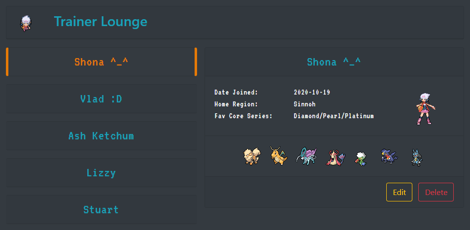

# pokefan

<h1 align="center">
    
</h1>
 

<h3 align="center">
    
</h3>
<h3 align="center">
    Manage your favourite Pokémon: 
    Add, edit and remove any Pokémon you like, or even make your own.
</h3>
 
 

<h3 align="center">
    
</h3>
<h3 align="center">
    Relax in the Trainer Lounge: 
    Create yourself and your friends as trainers, and show off Pokémon you are a fan of.
</h3>
 
 

This project showcases my first time working with Bootstrap, jQuery and Ajax.
